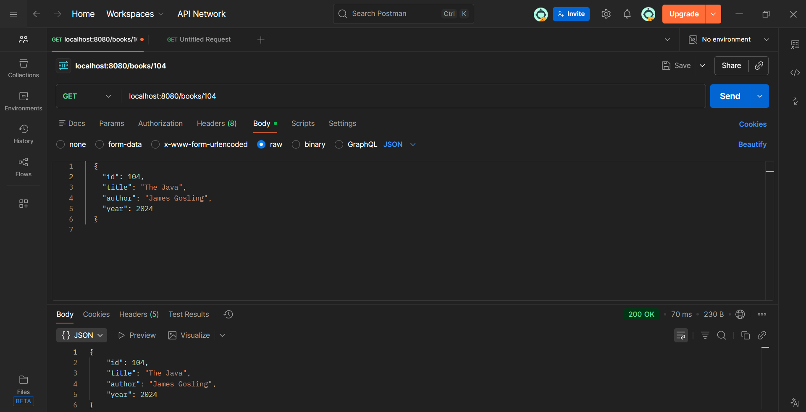
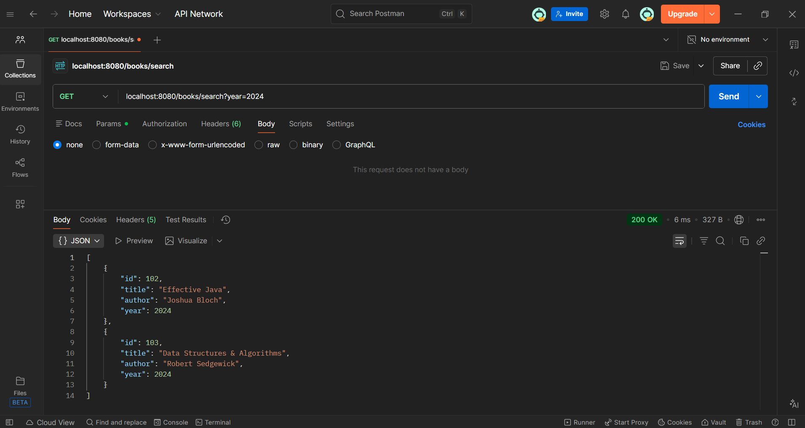

IN-MEMORY LIBRARY API (SPRING BOOT)
======================================

### 1. Project Title & Goal
--------------------------------------------------
The goal of this project is to build a simple REST API using Spring Boot that manages a library’s book inventory using strictly in-memory storage, allowing users to add, retrieve, search, and delete books without requiring an external database.

### 2. Setup Instructions
--------------------------------------------------
**Prerequisites:** Java 17 installed.

**How to Run:**
1. Clone this repository or download the source code.
2. Open the project in **IntelliJ IDEA**.
3. Navigate to `src/main/java/com/example/library/LibraryApiApplication.java`.
4. Click the **Run** button.
5. The server will start at `http://localhost:8080`.

**Test Commands (Postman or Browser):**
* **Add Book (POST):** `http://localhost:8080/books`
* **Search (GET):** `http://localhost:8080/books/search?year=2024`
* **Search (GET):** `http://localhost:8080/books/{id}`
* **Delete (DELETE):** `http://localhost:8080/books/{id}`

### 3. The Logic (How I thought)
--------------------------------------------------
**Why did you choose this approach?**

I selected **Spring Boot** because it provides an embedded Tomcat server, which meets the "run locally" requirement without requiring complex server installation. For the storage, I used a simple `ArrayList` inside the Controller. This fulfills the "in-memory" constraint and ensures the application is fast and portable, with zero database configuration needed.

**What was the hardest bug you faced, and how did you fix it?**
--------------------------------------------------
The search feature initially returned all books instead of filtering them. The issue was in how I was handling the request parameter. I fixed it by using Java Streams to explicitly filter the list: `.filter(book -> book.getYear() == year)`. This ensured only books matching the specific year were returned.

### 4. Output Screenshots
--------------------------------------------------
Screenshots confirming successful data retrieval and filtering

**1. GET /books/{id} (Retrieve Single Book)**

--------------------------------------------------

**2. GET /books/search?year=2024 (Filter by Year)**

*(Screenshots shows successfully retrieving them via GET request)*

### 5. Future Improvements
--------------------------------------------------
If I had 2 more days, I would add:
1.  **Data Persistence:** Integrate MySQL so data is not lost when the server restarts.
2.  **Input Validation:** Add checks to ensure the "Year" is valid and "Title" is not empty.
3.  **Exception Handling:** Create better error messages if a user tries to delete a book ID that doesn't exist.

